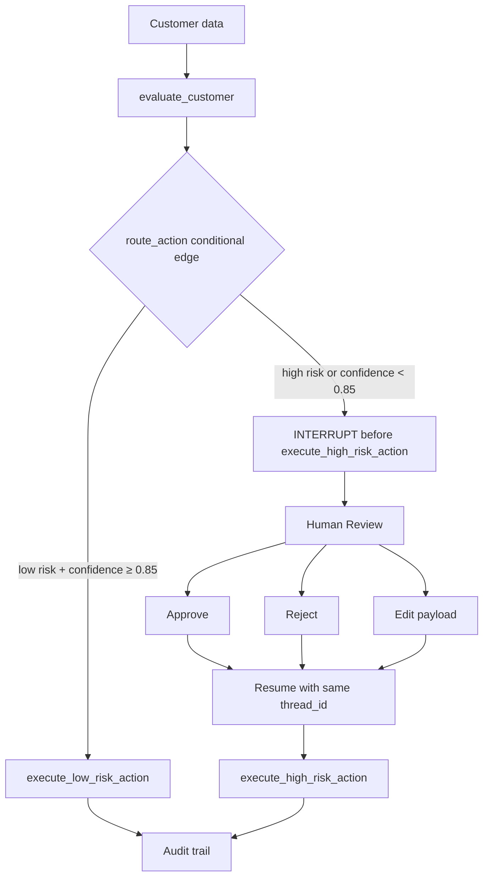

# Day27 — Human-in-the-Loop with LangGraph

Sinh viên: **Phạm Văn Vinh**
MSSV: **2A202601988**

Đây là workflow local đánh giá churn risk và minh hoạ Human-in-the-Loop (HITL) bằng LangGraph. Core không gọi LLM, không cần API key và dùng deterministic reasoning engine để kết quả có thể kiểm thử lặp lại.

## Architecture



Các module chính:

- `models.py`: `GraphState` và `AuditEntry`.
- `graph.py`: reasoning, routing, execution và compiled `StateGraph`.
- `audit.py`: audit JSON append-only với atomic write.
- `hitl.py`: API approve/reject/edit có thể unit test mà không cần Streamlit.
- `app.py`: giao diện Streamlit và audit table.
- `demo.py`: ba lifecycle demo chạy từ CLI.

## Setup

Khuyến nghị dùng conda environment `py3.12`:

```bash
conda activate py3.12
python -m pip install -r requirements.txt
```

Không cần `.env` hoặc credential.

## Run

```bash
pytest -q
python demo.py
streamlit run app.py
```

## Policy và confidence

`CONFIDENCE_THRESHOLD = 0.85`.

`increase_credit_limit` **ALWAYS requires human review, regardless of confidence**. Policy được kiểm tra trước confidence: action này luôn đi tới `execute_high_risk_action` và graph dừng ở `interrupt_before` node đó. Các action ít rủi ro chỉ auto-execute khi confidence đạt ít nhất `0.85`; dưới ngưỡng sẽ escalation để human review.

Reasoning engine dùng dữ liệu khách hàng: churn probability cao tạo đề xuất `increase_credit_limit`; churn thấp tạo `send_email`, còn thu nhập thấp làm confidence thấp hơn để minh hoạ escalation. Đây là mock có chủ ý, không phải mô hình dự báo production.

## Approve / Reject / Edit

Khi pending, Streamlit hiển thị action card và yêu cầu reviewer ID. Approve chạy action gốc. Reject kết thúc workflow với `execution_status = rejected`. Edit cho phép sửa payload (ví dụ credit amount), lưu `edited_action_payload`, rồi resume; executor dùng payload đã sửa thay vì payload gốc. Ba thao tác đều ghi audit record.

## Persistence và interrupt

Graph được compile với `MemorySaver`, `interrupt_before=["execute_high_risk_action"]`. Mỗi workflow dùng `configurable.thread_id` ổn định cho invoke, `get_state`, `update_state` và resume. Vì `MemorySaver` chỉ in-memory nên restart process sẽ mất checkpoint; audit JSON vẫn giữ lịch sử. Production nên dùng persistent checkpointer và append-only database.

## Audit location

Audit được append vào `audit_log.json` bằng temporary file và `os.replace`, không overwrite history. `reports/test_output.log` và `reports/demo_output.log` là evidence sinh ra từ các lệnh chạy thật.

## Known limitations

- Reasoning engine là deterministic mock, chưa phải LLM hoặc model churn đã calibrated.
- `MemorySaver` không bền qua process restart.
- JSON phù hợp cho lab nhỏ, chưa có locking/DB production.
- Streamlit UI chưa thay thế authentication/authorization của hệ thống thật.

## CI

`.github/workflows/ci.yml` cài requirements và chạy `pytest -q`; không cần API key.
